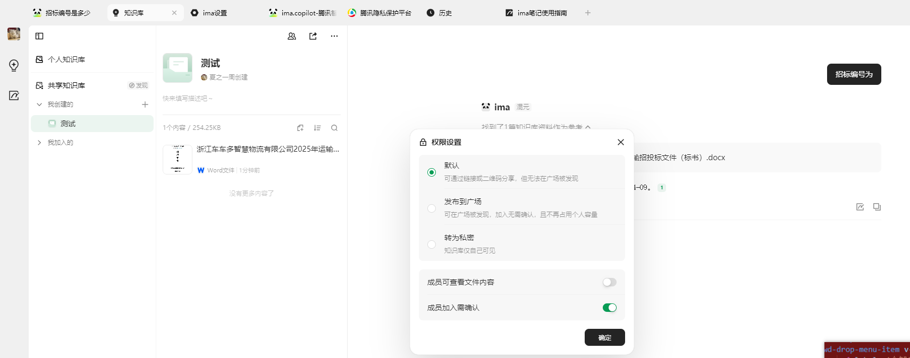
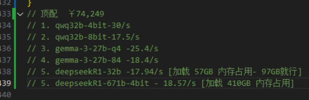
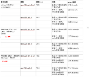

# AI大模型

https://www.bilibili.com/video/BV1R6P7eVEtd/?spm_id_from=333.1007.top_right_bar_window_history.content.click

> - 论文阅读：
>   - LoRA 开山论文：2021 年 Microsoft Research 提出，首次提出了通过**低秩矩阵分解**的方式来进行**部分参数微调**，极大推动了 AI 技术在多行业的广泛落地应用：[LoRA: Low-Rank Adaptation of Large Language Models](https://arxiv.org/abs/2106.09685)
>   - 大语言模型开山论文：2017 年 Google Brain 团队发布，标志着 **Transformer** 架构的提出，彻底改变了自然语言处理（NLP）领域，标志着大语言模型时代的开始：[Attention Is All You Need](https://arxiv.org/abs/1706.03762)


## 入门认知


### 模型部署及价值

- Ollama
  - 模型部署
- [Dify](https://dify.ai/zh)
  - 案例：中铁水务客服助理
- [ChatBox AI](https://chatboxai.app/zh)
  - 智能对话的界面
- MaxKB
  - 私有知识库 - RAG检索增强生成
  - 函数库 - 工作流编排
  - 案例：中铁水务客服助理
- 其他
  - 嵌入到企业官网，以及微信公众号、企业微信、钉钉、飞书、OA 等系统


### 未来思考

- 能做什么？

  > 现有大模型的底层实现，依靠大量资金实力，借助头部企业实现，如deepseek、通义千问...
  >
  > 当前我们迫切需要使用，实现模型落地应用开发
  >
  > 业务数据来源（mysql、hive、hbase）
  
- 和原有的业务生态系统打通

  - LLM、一条完整的工具链
  - 大公司 - 通用应用开发中...

- 中小企业：细分领域

  - 业务数据 -> 数据清洗(复杂) 
    - rag - 数据向量处理 - 业务数据量不是特别大的场景 
    - sft - 人工处理 标注数据 - 训练业务模型

  - 训练自己的代码开发助手（微调）
  - 


### 技术概念

> - 微调：将知识喂给模型，模型消化吸收成为参数的一部分
> - 强化学习：根据人类反馈，调整结果，生成个性化答案
> - 检索增强生成：给予模型-额外的知识来源


#### 三种训练方式

- SFT 有监督微调
  - 通过提供人工标注的数据，进一步训练 **预训练模型**，让模型能够更加准确地处理特定领域的任务
  - 除此之外，还有无监督微调、自监督微调，常见为有监督微调
- 强化学习 RLHF
  - DPO
    - 核心思想： 通过 **人类对比选择**，直接优化生成模型，使其产生更符合用户需求的结果，调整幅度大
  - PPO 【Proximal Policy Optimization】
    - 核心思想：通过 **奖励信号**，渐进式调整模型的行为策略，调整幅度小
- 检索增强生成 RAG
  - 将外部信息检索与文本生成结合，帮助模型在生成答案时，实时获取外部信息和最新信息


#### 微调还是RAG ？

- 微调
  - 适合：拥有非常充足的数据
  - 能够直接提升模型固有能力，无需依赖外部数据，反应速度更快、更稳定
- RAG
  - 适合：非常少的数据量，数据需要动态更新
  - 每次回答前需耗时检索知识库，回答质量依赖于知识库的质量


###  有监督微调 SFT

- 通过提供**人工标注**的数据，进一步训练**预训练模型**，让模型能够更加精准地处理**特定领域**的任务

  - 人工标注的数据

  ```json
  // 如：分类系统
  {"image_path": "path/image1.jpg", "label": "SpongeBobSquarePants"}
  {"image_path": "path/image2.jpg", "label": "PatrickStar"}
  // 如：对话系统
  {
      "instruction": "请问你是谁",
      "input": "",
      "output": "您好，我是蟹堡王的神奇海螺，很高兴为您服务！我可以回答关于蟹堡王和汉堡制作的任何问题，您有什么需要帮助的吗？"
  },
  ```

  - 预训练模型（基座模型）
    指已经在大量数据上训练过的模型，也就是我们微调前需要预先下载的开源模型。它具备了较为通用的知识和能力，能够解决一些常见的任务，可以在此基础上进行进一步的微调（fine-tuning）以适应特定的任务或领域
  - 微调算法的分类
    - 全参数微调（Full Fine-Tuning）
      - 对整个预训练模型进行微调，会更新所有参数。
      - 优点：因为每个参数都可以调整，通常能得到最佳的性能；能够适应不同任务和场景
      - 缺点：需要较大的计算资源并且容易出现过拟合
    - 部分参数微调（Partial Fine-Tuning）
      - 只更新模型的部分参数（例如某些层或模块）
      - 优点：减少了计算成本；减少过拟合风险；能够以较小的代价获得较好的结果
      - 缺点：可能无法达到最佳性能
      - 最著名算法：LoRA


#### LoRA 微调算法

- 微调常见实现框架
  - [初学者如何对大模型进行微调？](https://www.zhihu.com/question/638803488/answer/84354509523)
  - **Llama-Factory**：由国内**北航**开源的低代码大模型训练框架，可以实现**零代码微调**，简单易学，功能强大，且目前热度很高，建议新手从这个开始入门
  - **transformers.Trainer**：由 **Hugging Face** 提供的高层 **API**，适用于各种 NLP 任务的微调，提供标准化的训练流程和多种监控工具，适合需要更多**定制化**的场景，尤其在**部署和生产环境**中表现出色
  - **DeepSpeed**：由**微软**开发的开源深度学习优化库，适合大规模模型训练和**分布式训练**，在大模型**预训练**和资源密集型训练的时候用得比较多


## 能做的事

### 知识库搭建

- 阿里云百练

- [扣子Ai](https://www.coze.cn/)

- 腾讯 ima

  > 承诺保护用户隐私和数据安全，不会擅自使用用户存储在 ima知识库的数据进行模型训练。

  - 创建内部共享知识库

  





