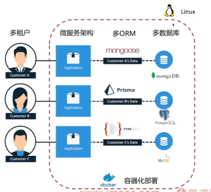
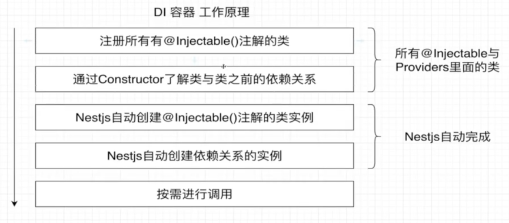
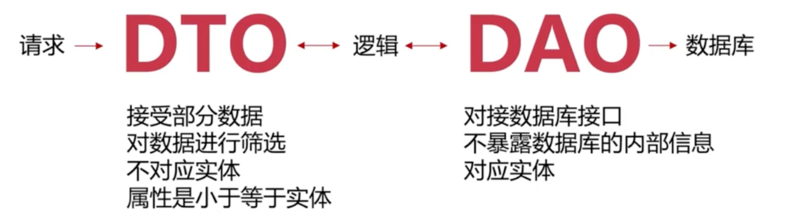
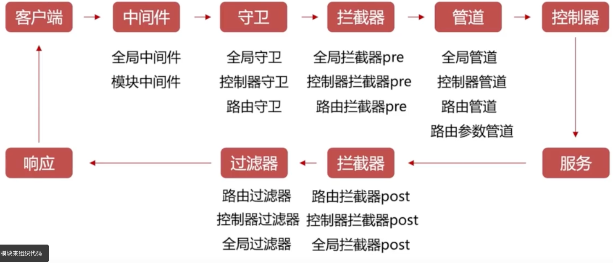
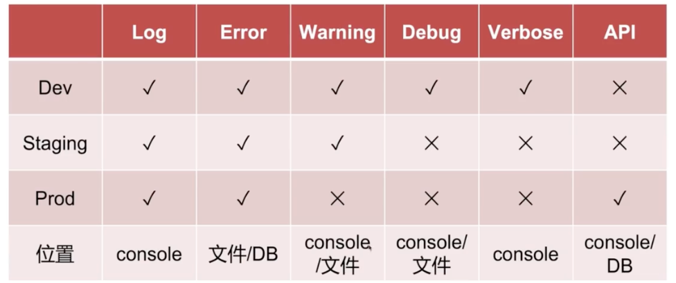

#  Nest.JS


> 用于构建 高效、可扩展 的NodeJs服务器端应用程序框架，提供开箱即用的 应用程序架构。
>
> “约定大于配置”，好的工程化目录（约定）能够提升项目的可维护性。
>
> - [截至点 6-4](https://www.bilibili.com/video/BV1LRNXeyEhQ/?spm_id_from=333.788.player.switch&vd_source=49059bedc59884104ea6ef0a6e552378)
> - [当前选择](https://www.bilibili.com/video/BV1LqPKe2E1W/?spm_id_from=333.788.videopod.episodes&vd_source=49059bedc59884104ea6ef0a6e552378)


- 特点
  - 模块化、类型安全TS、web应用、依赖注入
  - 可扩展性：全面路由功能设计、多配置/日志
  - 微服务：企业级应用架构
  - 开箱即用：官方CLI/REST模版
  - 丰富生态：GraphQL / 任务队列 / 缓存 / WS / ORM
- 目标
  - 复杂业务：多租户 菜单权限 CMS示例 多种ORM多数据库
  - 高并发高可用：微服务架构 Consul注册中心 灾备与切换 gRPC通信
  - 安全与权限：JWT鉴权 完整RBAC实现 CASl策略权限 安全头 请求限制 接口版本控制
  - 扩展与集成：monorepo开发 nx云构建 pnpm workspace  多环境配置





## 前置知识

### CLI

```shell
pnpm i -g @nestjs/cli # 全局安装 nestjs/cli 脚手架工具

nest --help
nest new [YouProjectName]   # 创建空白 nest项目

nest g module xxx 	# 创建xxx模块及对应xxx.module.ts文件
nest g controller xxx # 创建xxx模块的xxx.controller.ts文件，并追加到xxx.module.ts中
nest g service xxx # 创建xxx模块的xxx.service.ts文件
nest g class user -d # -d 修饰符，仅展示对应命令将产生的结果，不会有实际文件产生
--no-spec # 不创建对应的测试文件

pnpm start:dev # 启动项目并监听文件的改动，自动重启
pnpm start:dev -- -b swc # `-- -b swc` 标志将使用SWC builder提升开发过程的构建速度

```


### 最佳实践

#### 目录结构

```shell
# 推荐目录结构
# 特点
	- 文档及相关资源在根目录，包括 typings test bin
	- src 中针对功能划分不同的文件夹，抽离公共代码
# 特点

- bin
- dist
- pubilc
- src
	- config # 配置
	- entity # 实体类
	- auth # 鉴权
	- common # 公共代码
		- constants
		- controllers
		- decorators
		- dto
		- filters
		- guards
		- interfaces
		- interceptors
		- middleware
		- pipes
		- providers	
		- *
	- shared
	- gql
	- *
- test
- typings


# 其他功能模块
- src/greeter
 - greeter.constant.ts
 - greeter.controller.ts
 - greeter.service.ts
 - greeter.module.ts
 - greeter.*.ts
 - index.ts
```


#### 代码规范

> [参考 Angular 风格指南 ](https://v9.angular.cn/guide/styleguide)

- 总则
  - 坚持每个文件只定义一样东西（例如服务或组件）
  - 把文件大小限制在400行以内
  - 坚持定义简单函数
    - 考虑限制在75行之内
- 命名
  - 坚持所有符号使用一致的命名规则
  - 坚持遵循同一个模式描述符号的特性和类型
- 使用点和_分割文件名
  - 坚持在描述性名字中，使用_分割单词
  - 坚持使用 点 分割描述性名字和类型
  - 先描述组件特性，在描述类型的模式，推荐`feature.type.ts`
  - 坚持惯用的后缀描述类型，例如`.service .component .pipe .module .directive`等
- 符号和文件名
  - 为所有的东西使用一致的命名约定
  - 坚持使用大写驼峰命名法 命名类`例：UserType`
  - 坚持匹配符号名与它所在的文件名
  - 坚持在 文件名/符号名 后追加约定的类型后缀`例：.compontent.ts  .module.ts`等
  - 坚持使用 - 符号，命名组件的元素选择器


### 编程思想

- FP 函数式编程
  - 确定的数据输入、输出；没有“副”作用，相对独立
  - 引用透明，对IDE友好，易于代码理解
  - 易于逻辑复用、抽离
  - 现代hook的 Vue React为例
- OOP 面向对象编程
  - 抽象事物的特征，对于理解友好
  - 封装性（高内聚低耦合）、继承性、多态性
  - Java、C#为典型
- FRP 函数式响应式编程
  - 适合对事件流进行复杂组合应用的场景
- AOP 面向切面编程
  - 扩展功能方便，不影响业务之间的逻辑
  - 逻辑集中管理、有利于代码复用
  - 在不破坏封装功能的前提下，额外增加功能
  - NestJS 使用！！！


- IoC是一种设计模式&思想  DI是IoC的具体实现
  - IOC 控制反转【 Inversion Of Control 】
    - 一种面向对象的设计原则，用于降低代码间耦合度
    - 借助“第三方” 实现具有依赖关系的对象之间的解耦
  
  - DI 依赖注入【Dependency Injection】
    - 用于实现IoC的设计模式，允许在类外创建依赖对象，并通过不同方式将这些对象提供给类 
  





- MVC 模型/视图/控制器的软件架构模式
  - Model
  - View
  - Controller


- DTO 数据**传输**对象 【Data Transfer Object】
  - 约定数据字段、属性，便于数据校验

- DAO 数据**访问**对象 【Data Access Object】
  - 一层逻辑
  - 包含：实体类、数据库操作crud、数据校验、错误处理等
  - 代码中实际对应




## 基础入门

#### NestJS 核心概念

- 【 Client 客户端：发送请求，接收响应 】
- Controller 控制器：负责处理请求、返回响应，使用Service
- Service 服务：提供方法和操作，只包含业务逻辑，不涉及数据处理，如获取数据、删除数据
- Data Access 数据接入：负责访问数据库中的数据


#### 生命周期




#### 模块

- 使用 Module 来组织应用程序，每个Module代表一个模块
  - @Module 装饰器，用于描述模块
- 模块属性
  - imports      exports
  - providers
  - controllers
- 模块分类
  - 功能模块 / 共享模块
  - 全局模块：通常应用在配置、数据库连接、日志上
  - 动态模块：在使用时再进行初始化，类似前端的懒加载

```typescript
@Module({
  import:[
    // xxx
  ],
  controllers:[AppController], // 可使用providers注入的内容
  providers:[AppService], // Srevice中可以使用import中导入的模块
})
```


#### @nestjs/config

> 配置模块


- 内部使用 dotenv 实现
- 方法
  - `.forRoot()`静态方法导入它的配置
  -  `this.configService.get('DATA_NAME')` 获取env变量数据


##### 简单配置

```typescript
pnpm i --save @nestjs/config // 安装 nestjs/config 依赖

// app.module.ts 导入 ConfigModule 模块 [根模块AppModule中]
import { ConfigModule } from '@nestjs/config'
@Module({
  imports:[ConfigModule.forRoot()],
})
export class AppModule {}


// 注入 xxx.controller.ts [isGlobal为true 全局配置后，任意模块的controller都可使用，无需再module引入]
import { ConfigService } from '@nestjs/config'

@Controller('user')
export class xxxController {
  constructor(..., private configService: ConfigService) {}
  
  @Get()
  getDB():any {
    const db = this.configService.get('DATABASE_USER')
    return db;
  }
  ...
}


// .env 定义数据
DATABASE_USER=wudetian
DATABASE_PASSWORD=test


// 更多配置
ConfigModule.forRoot({
  envFilePath: '.development.env', // 更改 env 文件路径为 .development.env 【借助process.env.NODE_ENV和corss-env 实现不同的环境配置】
  // envFilePath: ['.env.development', '.env'], // 使用多个路径，按顺序第一个出现的变量优先
 
  ignoreEnvFile: true, // 禁止加载环境变量
  isGlobal: true, // 全局使用，无需再在其他模块module中引入即可使用
  
  load: [()=>({port: 8888,host:'wudetian'})], // 自定义配置，函数返回值作为env信息的补充
})

```


##### [参数验证Joi](https://www.npmjs.com/package/joi)

- 具体Joi使用参看官方文档/本站相关内容
- 注意
  - 无法校验 load 函数中返回的配置校验！！！

```typescript
import * as Joi from 'joi'

ConfigModule.forRoot({
  ...
  validationSchema: Joi.object({
    DB_PORT: Joi.number().default(3306), // 限制要求 DB_PORT数据类型为number，未传值时默认值为3306
  })
})

```


#### 日志模块

##### 介绍

- 三方日志方案
  - winston 推荐_250514
  - pino 新潮儿
- 日志等级
  - Log：通用日志，按需求记录
  - Warning：警告日志，例如多次进行数据库操作
  - Error：严重日志，如数据库异常
  - Debug：调试日志，如加载数据日志
  - Verbose：详细日志，所有的操作与详细信息（非必要不打印）
- 功能分类
  - 错误日志：方便定位问题，给用户友好提示
  - 调试日志：开发使用
  - 请求日志：记录敏感行为
- 记录位置
  - 控制台日志：调试使用
  - 文件日志：方便回溯追踪（24h 滚动）
  - 数据库日志：敏感操作、敏感数据记录




##### 内置日志

> 由 `@nestjs/common` 包中的 `Logger` 类实现；属于默认的全局模块，无需import，可直接使用

- 使用日志 Logger
  - 推荐
    - 在每个提供者内实例化 `@nestjs/common` 内的 `Logger` 类
    - 以将提供者的名字当作 `context` 参数传入 `Logger` 的构造函数

```typescript
// main.ts 全局日志配置
const app = await NestFactory.create(ApplicationModule, {
 // logger: false, // 关闭nestjs日志，默认为true
  logger: ['error', 'warn'], // 只启用特定日志级别
});

// 使用日志
import { Logger } from '@nestjs/common'

@Injectable()
class MyService {
  private readonly logger = new Logger(MyService.name);

  doSomething() {
    this.logger.log('Doing something...');
  }
}
```


##### [nestjs-pino](https://www.npmjs.com/package/nestjs-pino)

- https://getpino.io/#/
- https://github.com/iamolegga/nestjs-pino#readme

```typescript
pnpm i nestjs-pino // 安装 nestjs-pino 依赖
pnpm i pino-roll // 【可选】实现pino 自动滚动日志文件

// xxx.module.ts
import { LoggerModule } from 'nestjs-pino'
import { join } from 'path'

@Module({
   // 导入模块
  import:[
    LoggerModule.forRoot({
      pinoHttp:{
        transport:process.env.NODE_ENV === 'development' ? { // 开发环境对日志进行格式化展示，便于观察
          target:'pino-pretty',
          options:{
            colorize:true,
          } :{
           	target:'pino-roll', // 生产环境，借助 pino-roll
          	// options 可配置日志保存目录、滚动频率、滚动文件大小 等
          	options:{ file: join('logs', 'log'), frequency: 'daily', mkdir: true } 
        	}
        }
      }
    })
  ],
})

// xxx.controller.ts
import { Logger } from 'nestjs-pino'
@Controller()
export class AppController {
  constructor(private loogger: Logger){}
  
  @Get()
  getHello(): string {
     this.logger.log('pino的logger：getHello请求成功'); // 这将导致打印两次：因为pino会默认进行打印log
  }
}
```


##### [nest-winston](https://www.npmjs.com/package/nest-winston)

- https://www.npmjs.com/package/winston
- https://www.npmjs.com/package/nest-winston
- https://www.npmjs.com/package/winston-daily-rotate-file 滚动日志

```typescript
pnpm install --save nest-winston winston // 安装nest-winston


// main.ts

```


### TypeORM

> ORM 对象关系映射，将面向对象的概念与数据库中的概念对应【对象-表 对象的实例-一条记录】

- ORM 特点
  - 便于维护，数据模型定义在同一个地方，利于重构
  - 代码量少，支持多种数据库对接
  - 工具多、自动化能力强：数据库删除关联数据、事务操作等
- 缺点
  - 不利于SQL语句优化，高度封装
- 常见ORM
  - TypeORM
  - EdgeDB
  - Prisma

```typescript
// 安装 typeorm 相关依赖 + mysql2
pnpm i --save @nestjs/typeorm typeorm mysql2


```


### 补充内容

#### 其他优化

- 已知

  - 借助webpack实现热重载模式-动态对比每次更新并执行，提升开发时代码热更新后的构建速度

- 简单

  - 配置Vscode调试

    - 调试窗口，新增配置文件 launch.json

    - 配置node npm 调试

      ```json
      // launch.json
      {
          "version": "0.2.0",
          "configurations": [
              {
                  "name": "Launch via NPM",
                  "request": "launch",
                  "runtimeArgs": [
                      "run-script",
                      "start:debug"
                  ],
                  "runtimeExecutable": "npm",
                  "runtimeVersion": "default",
                  "internalConsoleOptions": "neverOpen",
                  "skipFiles": [
                      "<node_internals>/**"
                  ],
                  "type": "node"
              },
          ]
      }
      ```

      


#### 注解 Injectable

- 底层使用 `reflect-metadata`


#### 模版库实现View

- 常见：vue、react、next、pug、hus、ejs等


#### 多环境配置方案


##### [cross-env](https://www.npmjs.com/package/cross-env)

- 运行跨平台设置和使用环境变量的脚本

```json
pnpm i --D cross-env // 安装依赖

// package.json
"scripts":{
  "start:dev":"cross-env NODE_ENV=development nest start --watch"
}

// app.module.ts
console.log(process.env.NODE_ENV); // development
```


##### [dotenv](https://www.npmjs.com/package/dotenv)

- 读取`.env`文件中的配置，在代码中使用

```js
// .env
USERNAME="wudetian"
DATABASES_USERNAME=username
DATABASES_PASSWORD=password

// index.js
require('dotenv').config()
console.log(process.env)
```


##### [congif](https://www.npmjs.com/package/config)

- 读取`json 或 yaml`文件中的配置
- 会自动合并default和production
- 相比detenv，支持json格式数据，直接访问

```js
// default.json
{
  "token_secret":"long"
  "db":{
    "host":5200,
    "username":'wudetian.top',
    "password":"666888"
  }
}

// production.yaml 会自动合并default和production
db:
	host:'wudetian'
	post:5555

// index.js
const config = require('config');
const dbCongig = config.get('db'); // db 与 json 文件中的key一致
console.log(dbConfig); // 得到db的对象


// package.json - 区分环境配置
scripts:{
  "dev":"cross-env NODE_ENV=development node index.js",
   "prod":"cross-env NODE_ENV=production node index.js"
}

```


#### [参数验证Joi](https://www.npmjs.com/package/joi)

- https://joi.dev/api/

```typescript
Joi.number() // number类型
.default(3306) // 设置默认值
.valid('dev','prod','uat') // 可取值的枚举,不能取其他值

.ip()
.domin()
```


#### 流程

- 创建空白项目
- 引入@nestjs/config配置
- 引入cross-env配置packags.json，实现多环境env配置
- 引入 joi 实现env数据类型限制校验


#### @装饰器

> 装饰器在诸多语言中均有使用，nestJS中存在广泛应用

| 装饰器类型            | 描述                                  | nestJS中      |
| --------------------- | ------------------------------------- | ------------- |
| 类装饰器 Class        | 类构造函数，用于修饰类的定义          | @Module       |
| 方法装饰器 Method     | 用于修改方法的行为                    | @Get          |
| 访问器装饰器 Accessor | 应用于类的访问器属性 getter 或 setter |               |
| 属性装饰器 Property   | 应用于类的属性                        | @IsNotEmpty() |
| 参数装饰器 Parameter  | 应用于方法参数                        | @Query        |


- 执行顺序
  - 方法、访问、属性 装饰器按照在类中出现的顺序从上往下依次执行
  - 类装饰器最后执行
